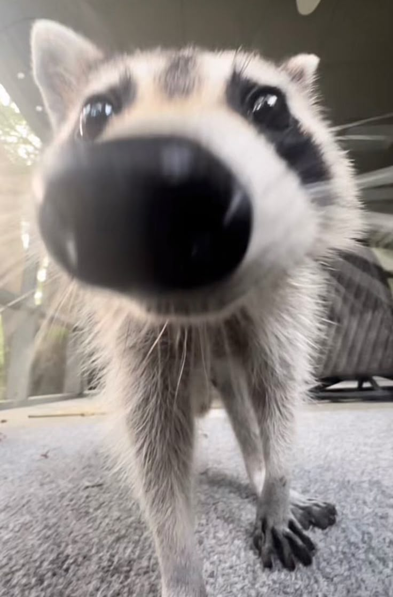

# Simple Platformer

  <!-- Replace with your raccoon pixel art -->
  

A small platformer made in Godot with C#.

This project was created while following Brackeys' Godot platformer tutorial and experimenting with my own changes along the way.

## Credits

Brackeys' tutorial:
https://youtu.be/LOhfqjmasi0?si=GDe9VD1JRkksyS86

## Todo

* [ ] Enemies
* [ ] Collectibles
* [ ] More levels
* [ ] Sound effects
* [ ] Animations
* [ ] Main menu
